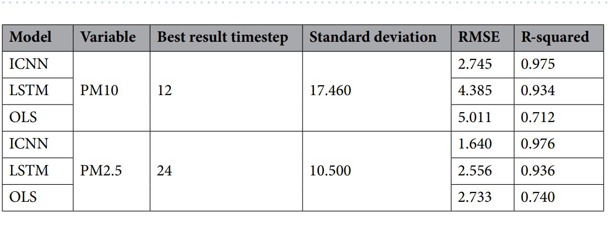

---

#### Overview

In recent years, the issue of air pollution and its detrimental effects on human health and the environment has garnered significant attention. The accurate prediction of air quality, particularly the concentration of `particulate matter (PM)`, is crucial for effective pollution management and the implementation of timely mitigation strategies. In this research project, we aim to develop prediction models for `PM10`, a specific type of `PM` with a diameter of 10 micrometers or less, by leveraging the influence of multiple air pollutants as predictors.

To lay the foundation for this study, a comprehensive review of the existing literature was conducted. We analyzed and synthesized findings from `four research papers` that were specifically selected for their relevance and significance to our research objectives. These papers were chosen based on their insights into the prediction of air quality, the utilization of multiple air pollutants as predictors, and their focus on `PM10` or related pollutants.

By examining these research papers, we aim to build upon the existing knowledge and identify gaps in the literature that our research project can address. The synthesis of these studies allows us to identify key trends, methodologies, and findings, providing a comprehensive understanding of the current state of research in air quality prediction using multiple air pollutants as predictors for `PM10`. In the subsequent sections of this literature review, we will delve into the details of each research paper, critically analyzing their methodologies, results, and contributions to the field.

---

#### 1. Deep Learning Techniques for Air Pollution(Kshitij Tripathi, Pooja Pathak)

Air pollution has devastating consequences, leading to approximately 7 million premature deaths worldwide. The World Health Organization (WHO) acknowledges that air quality is a significant risk factor for noncommunicable diseases (NCDs). It is estimated that 24% of all adult deaths from heart disease, 25% of deaths from stroke, 43% of deaths from chronic obstructive pulmonary disease, and 29% of deaths from cancer are attributed to air pollution. In 2019, 21 out of the 30 most polluted cities globally were located in India, highlighting the severity of the issue and the need for extensive research in this area.

While India has relatively low greenhouse gas emissions per capita compared to China and the United States, as a whole, it ranks as the third-largest greenhouse gas producer. To prevent India from becoming the leading contributor to greenhouse gas emissions, it is crucial to establish improved techniques. The aforementioned study aids researchers in identifying the areas in which we lack knowledge and understanding when it comes to predicting air pollution in India. One notable area that requires attention is the inclusion of spatio-temporal information, as air pollution is heavily influenced by geographical location and time.

Furthermore, this paper addresses the key challenges associated with air pollution prediction methods and proposes ways to overcome these limitations. Additionally, the paper explores various deep learning techniques employed for air pollution prediction. Among these techniques, `CNN-LSTM` stands out as the widely used and popular strategy. 
| Sr No |  Approach  |              Advantage                         |          Limitation                      | Parameters | 
|-------|------------|------------------------------------------------|------------------------------------------|------------|
|   1   | CNN + LSTM | Importance of Spatiotemporal in predicting CO2.| A less parameter is considered for prediction | `CO2` |
|   2   |     LSTM   |Hourly prediction of air contaminant concentrations|Location is limited to Delhi, India| `O3`, `PM2.5`|
|   3   |DBNSE framework|Helpful in finding hidden dependencies between pollutants|The presence of other greenhouse gases are not considered | `NO2 and PM2.5`|
|   4   | State of science emission inventories and atmospheric chemical trnasport models | Quantificaiton of the atmospheric composition owing to household sources. |Spatial and Temporal dependency of elements not considered| `PM2.5 and O3`|

<figcaption style="text-align: center">Table 1: Related Study in terms of India</figcaption>

---

#### 2. PM10 and PM2.5 realtime prediction models using an `interpolated convolutional neural network` (Sangwon Chae1, Joonhyeok Shin1, Sungjun Kwon1, Sangmok Lee1, Sungwon Kang2 & Donghyun Lee)

In this paper, they have proposed a real-time prediction model that can respond to `particulate matters(PM)` in the air, which are an indication of poor air quality. The model applies interpolation to air quality and weather data and then uses a `Convolutional Neural Network (CNN)` to predict `PM` concentrations. The interpolation transforms the irregular spatial data into an equally spaced grid, which the model requires. This combination creates the `interpolated CNN (ICNN)` model that we use to predict `PM10` and `PM2.5` concentrations. The `PM10` and `PM2.5` evaluation results show an efective prediction performance with an R-squared higher than 0.97  and a `root mean square error (RMSE)` of approximately 16% of the standard deviation. Furthermore, both `PM10` and `PM2.5` prediction models forecast high concentrations with high reliability, with a probability of detection higher than 0.90 and a critical success index exceeding 0.85.

They have attempted to convert the air quality monitoring station data into multidimensional arrays. However, the air pollution monitoring stations in South Korea are concentrated in specifc regions, and the geographical distances between the stations are unequal. This indicates that the spatial data of the measured values are not uniform. Hence, they proposed an `ICNN prediction model` that performs data transformation and training in turn. The `ICNN prediction model` transforms the spatially imbalanced measured values into uniform data through interpolation and then predicts the `PM` concentration through a `CNN` model. To solve the spatial imbalance, the `ICNN` prediction model creates an equally spaced empty grid. Subsequently, equal distance data are generated by integrating the data as if a virtual measuring station were located at each grid point.The generated equal distance data are used as input data of a CNN model that performs training within the ICNN prediction models. The `ICNN prediction model` learns the properties of the data by using pre-interpolated data in the form of a grid during model training, which is expected to increase the prediction accuracy.
<!--  
 -->

<table style="text-align:center;margin: auto;">
  <thead>
    <tr>
      <th>Model</th>
      <th>Variable</th>
      <th>Best Result Timestep</th>
      <th>Standard Deviation</th>
      <th>RMSE</th>
      <th>R-squared</th>
    </tr>
  </thead>
  <tbody>
    <tr>
      <td>ICNN</td>
      <td rowspan=3>PM10</td>
      <td rowspan=3>12</td>
      <td rowspan=3>17.460</td>
      <td >2.745</td>
      <td >0.975</td>
    </tr>
    <tr>
      <td>LSTM</td>
      <td>4.385</td>
      <td>0.934</td>
    </tr>
    <tr>
      <td>OLS</td>
      <td>5.011</td>
      <td>0.712</td>
    </tr>
    <tr>
      <td>ICNN</td>
      <td rowspan=3>PM2.5</td>
      <td rowspan=3>24</td>
      <td rowspan=3>10.500</td>
      <td>1.640</td>
      <td>0.976</td>
    </tr>
    <tr>
      <td>LSTM</td>
      <td>2.556</td>
      <td>0.936</td>
    </tr>
    <tr>
      <td>OLS</td>
      <td>2.733</td>
      <td>0.740</td>
    </tr>
    <!-- Add more rows as needed -->
  </tbody>
</table>
<figcaption style="text-align: center">Table 2: Observaions from mentioned paper</figcaption>

---
#### 3. Air Pollution Prediction by Deep Learning Model(`BiLSTM`)

A specialtry over `LSTM` is `BILSTM` has forward activation and backward activation when calculating output o at time t. The input data of both past and feature at a specific period is used to train the bidirectional LSTM which is opposite to unidirectional LSTM where input is only information from the past. `Bidirectional LSTM` on the other hand with the help of two hidden states combined preserves both past and future information at a particular point of time. 

`Bidirectional LSTM` performs the same direction and reverses the direction of the sequence of data operations with the help of two layers and this surely results in more effective performance than `Unidirectional LSTM` . Similar to LSTM a slightly varied BILSTM reverse the data as mentioned earlier and the hidden layer produces the forward and reverse data. 

Though `LSTM` is an exclusive recurrent neural network, `BILSTM` with its advantages and superior performanceoriented architecture overtakes long short term memory which uses only information from past as input. This proposed model by using BILSTM predicted the PM2.5 with improved performance comparing the existing model and produced exceptional `MAE`, `RMSE`, and `SMAPE`. Exposure to `PM2.5` when its level exceeds the limit is hazardous to humans and predicting pollutants with deep learning algorithms accurately
helps the government body to signal its citizens as well as cut or regularize the sources of pollutants to a great extent.

---

#### 4. Impact of Maternal Air Pollution Exposure on Children's Lung Health: An Indian Perspective

The given research paper discusses the detrimental impact of air pollution on human health and its prevalence in India. Air pollution has emerged as a major global concern, causing morbidity, mortality, and economic losses. It is a significant threat to respiratory health, leading to conditions like `Chronic Obstructive Pulmonary Disease (COPD)`, asthma, interstitial lung diseases, and lung cancer. Fine particulate matter (`PM2.5`) and coarse particulate matter (`PM10`) are key indicators of air pollution severity, originating from various sources such as vehicles, industries, and households. The World Health Organization (WHO) estimates that air pollution contributes to millions of premature deaths annually, with India having the highest number of air pollution-related deaths. Exposure to air pollution during pregnancy is associated with adverse birth complications and increased risks for neurodevelopmental disorders and childhood asthma. Particulate matter consists of various substances, both organic and inorganic, with different sources, including indoor and outdoor emissions. India has high levels of air pollution, with many cities exceeding WHO guidelines. The effects of air pollutants in India include reduced life expectancy and significant health burdens, affecting not only the lungs but also other organs. Children, with their higher vulnerability and exposure, face long-term health consequences. The review aims to explore the health implications of maternal exposure to air pollution on children's health in India, highlighting cellular mechanisms and potential interventions.

| S. No. | Author | Study Design | Sample Size | Exposure | Parameter Studied | Comments and Assosiation |
|--------|--------|--------------|-------------|----------|-------------------|--------------------------|
|   1    |Padhy et al.,2009|Case-control|Control, Biomass user|Biomass smoke|Respiratory symptoms Oxidative stress Hematological changes|Exposure to biomass smoke significantly associated with respiratory diseases, oxidative stress, and hematological changes|
|2|Awasthi et al., 2010|Cohort|23 children(10 to 13 years of age)|Agriculture crop residue burning|Pulmonary function|Decrease in pulmonary function with an increase in air pollutant levels due to ACRB|
|3|Singh et al.,2015|Cross-sectional, multicenter|44,928 (6 to 7 year age group); 48,088 (13 to 14 year age group)|Traffic pollution maternal and paternal smoking|Asthma|Traffic pollution and maternal and paternal smoking is associated with increased prevalence of asthma|
 
<figcaption style ="text-align: center"> Table-3: List of studies on air pollution that have been carried out in an Indian population. </figcaption>
 

Air pollution has become a growing concern in recent years in India and globally, causing an enormous burden to society as well as loss of life. Air pollutants, particularly `PM2.5`, penetrate deep into the lungs and cause pathological changes which lead to impaired pulmonary function. Epidemiological studies demonstrate that exposure to PM induces oxidative stress that leads to
serious health effects. Similar mechanisms are involved in maternal air-pollution-exposure-induced health effects on offspring that are a result of increased oxidative stress resulting in damage to proteins and biomolecules and causing placental inflammation, induction of ER stress–autophagy, and mitochondrial dysfunction. Therapeutic strategies targeting air-pollution-induced oxidative stress and related signaling should be considered to enhance endogenous antioxidant defense mechanisms in the cell. On the other hand, use of novel autophagy modulators that can also block ER stress could be of great value for future research into preventing the development of pollutant-induced airway disease. Collectively, air-pollution-induced adverse health outcomes can be prevented by adopting a comprehensive global approach that works locally to eliminate or reduce the burden of PM both indoors and outdoors.

---

#### 5. An empirical study on hyperparameter tuning of decision trees

This paper states that the ideal min_samples_leaf values tend to be between 1 to 20 for the CART algorithm. This paper also indicates that max_depth, min_samples_split and min_samples_leaf are the most responsible for the performance of the final trees from their relative importance analysis.

##### 5.1 Hyperparameter - min_samples_leaf

This is used to control over-fitting by defining that each leaf has more than one element. Thus, ensuring that the tree cannot overfit the training dataset by creating a bunch of small branches exclusively for one sample each. In reality, what this is actually doing is simply just telling the tree that each leaf doesn’t have to have an impurity of 0.

##### 5.2 Hyperparameter - min_samples_split

This is used to control over-fitting. Higher values prevent a model from learning relations which might be highly specific to the particular sample selected for a tree.

---

#### 6. Reduced Bayesian Optimized Stacked Regressor (RBOSR): A highly efficient stacked approach for improved air pollution prediction.

In this study, a new approach called Reduced Bayesian Optimized Stacked Regressor (RBOSR) that optimizes both the performance and efficiency if the PM2.5 stacked model has been proposed. RBOSR incorporates Bayesian optimization for hyperparameter tuning, ensemble-based feature selection, dimensionality reduction via single-link hierarchical clustering, and recursive base estimator eliminations.

---

#### 7. A machine learning-based model to estimate PM2.5 concentration levels in Delhi's atmosphere

The proposed work is an attempt to accurately predict the PM2.5 levels and to increase the prediction accuracy, especially in Delhi's atmosphere. A model, for this, is proposed based on Extra Trees Regressor boosted with AdaBoost. Extra Trees is a tree-based ensemble technique, which strongly randomizes both the cut point choice and the attributes involved in it while splitting a tree node. It is used for supervised classification but can also be extended for regression problems. AdaBoost, stands for Adaptive Boosting, is a boosting algorithm used in conjunction with the learning algorithms to complement on its performances. The goal of this study is to improve the results obtained in the above-mentioned paper.

---